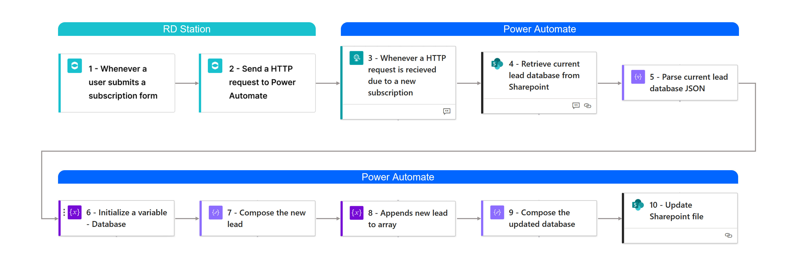
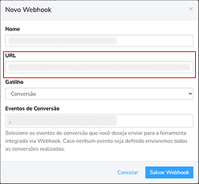

# RD Station Power BI Report 
### Lead capture tool with Power Automate, Sharepoint and Power BI
This Power BI report queries a JSON file containing lead data, which is generated via a **webhook** integration between **RD Station** and **Power Automate**. The automated flow stores new leads in a **Sharepoint** folder, creating a dynamic and queryable database for reporting purposes.

```
Note: Due to confidentiality, no original files are published. All visual content is anonymized or blurred for privacy purposes.
```

### Context and goal
The company launched a marketing campaign for an educational course. A subscription form created using RD Station was embbeded on a landing page. Project stakeholders needed to monitor the campaign's performance and access a centralized, shareable lead database with access control. 

### Architecture and workflow
#### Database creation
RD Station sends lead data via **webhook** *(push method)*, while Power BI queries data sources using a *pull method*. Therefore, an automated flow was created in **Power Automate** to receive, filter and transform **webhook** data. Then, the processed data is stored in a JSON file within a **Sharepoint** folder. **Sharepoint** was chosen as the storage layer because the company didn't provide a data warehouse or a data lake access.

This setup allows **Power BI** to connect and refresh the lead database whenever needed without requiring any external services or custom APIs.

##### Automated flow schema


Steps 1 and 2 happen within **RD Station**, where the **webhook** triggers and sends the request to start the **Power Automate** flow. The following steps occur in **Power Automate**. 

Trigger 1 - User subscription triggers the **webhook** flow  
Action 2 - An HTTP request is sent to the defined URL  
Trigger 3 - **Power Automate** receives the HTTP request  
Action 4 -  Retrieve the current leads database JSON file from **Sharepoint**  
Action 5 -  Convert JSON file content into structured data  
Action 6 -  Initialize an array variable named "Database" to store Action 5 output  
Action 7 -  Compose data from Trigger 3 output into JSON file schema  
Action 8 -  Update Database variable adding the new lead  
Action 9 -  Compose the variable to use as an input on Action 10 step  
Action 10 -  In **Sharepoint**, update JSON file content with Action 9 output   

*Important: Power Automate HTTP URL is generated after the first save, then it is necessary to copy it and paste it into the RD Station webhook configuration:*  
  


<details>
<summary> Webhook schema + Power Automate expressions </summary>

```json
{
  "Date": "@{utcNow()}",
  "E-mail": "@{triggerBody()?['leads']?[0]?['email']}",
  "Name": "@{triggerBody()?['leads']?[0]?['first_conversion']?['content']?['__cdp__original_event']?['payload']?['name']}",
  "Surname": "@{triggerBody()?['leads']?[0]?['first_conversion']?['content']?['__cdp__original_event']?['payload']?['cf_sobrenome']}",
  "Telephone": "@{triggerBody()?['leads']?[0]?['first_conversion']?['content']?['__cdp__original_event']?['payload']?['mobile_phone']}",
  "City": "@{triggerBody()?['leads']?[0]?['first_conversion']?['content']?['__cdp__original_event']?['payload']?['city']}",
  "State": "@{triggerBody()?['leads']?[0]?['first_conversion']?['content']?['__cdp__original_event']?['payload']?['state']}"
}
```
</details>

### Power BI
#### ETL: Power Query 
#### Report building

#### Report publishing
This model is currently set to update once a day. However, if real-time report were required, a Power BI model update step could be added to the Power Automate flow as Action 11.

### Implemented Features
Real time integration  
Automatic storage and update  
Centralized report  

### Business impact
