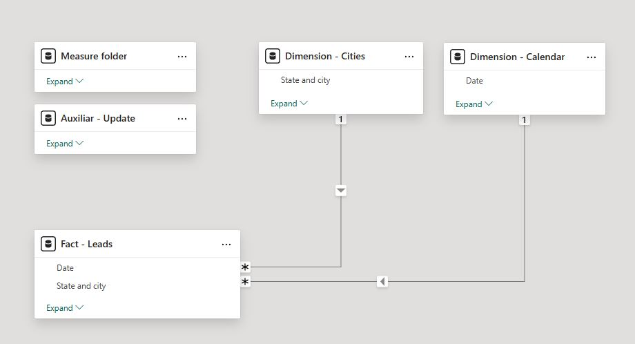

# RD Station Power BI Report 
### Lead capture tool with Power Automate, Sharepoint and Power BI
This Power BI report queries a JSON file containing lead data, which is generated via a **webhook** integration between **RD Station** and **Power Automate**. The automated flow stores new leads in a **Sharepoint** folder, creating a dynamic and queryable database for reporting purposes.

*Note 1: Due to confidentiality, no original files are published. All visual content is anonymized or blurred for privacy purposes.*  
*Note 2: The project was originally built in Portuguese, but it has been translated.*

### Context and goal
The company launched a marketing campaign for an educational course. A subscription form created using RD Station was embbeded on a landing page. Project stakeholders needed to monitor the campaign's performance and access a centralized, shareable lead database with access control. 

#### Important business rules
Stakeholders defined a few business rules:
1) The model only needs to refreshe once a day, around 08:00 AM.
2) It is possible to submit the form more than once. Only the lastest form submission from each lead counts.
3) E-mail is used as the lead ID.

### Architecture and workflow
#### Database creation
RD Station sends lead data via **webhook** *(push method)*, while Power BI queries data sources using a *pull method*. Therefore, an automated flow was created in **Power Automate** to receive, filter and transform **webhook** data. Then, the processed data is stored in a JSON file within a **Sharepoint** folder. **Sharepoint** was chosen as the storage layer because the company didn't provide a data warehouse or a data lake access.

This setup allows **Power BI** to connect and refresh the lead database whenever needed without requiring any external services or custom APIs.

##### Automated flow schema


Steps 1 and 2 happen within **RD Station**, where the **webhook** triggers and sends the request to start the **Power Automate** flow. The following steps occur in **Power Automate**. 

Trigger 1 - User subscription triggers the **webhook** flow  
Action 2 - An HTTP request is sent to the defined URL  
Trigger 3 - **Power Automate** receives the HTTP request  
Action 4 -  Retrieve the current leads database JSON file from **Sharepoint**  
Action 5 -  Convert JSON file content into structured data  
Action 6 -  Initialize an array variable named "Database" to store Action 5 output  
Action 7 -  Compose data from Trigger 3 output into JSON file schema  
Action 8 -  Update Database variable adding the new lead  
Action 9 -  Compose the variable to use as an input on Action 10 step  
Action 10 -  In **Sharepoint**, update JSON file content with Action 9 output   

*Important: Power Automate HTTP URL is generated after the first save, then it is necessary to copy it and paste it into the RD Station webhook configuration:*  
  


<details open>
<summary> Webhook schema + Power Automate expressions </summary>
  
```json
{
  "Date": "@{utcNow()}",
  "E-mail": "@{triggerBody()?['leads']?[0]?['email']}",
  "Name": "@{triggerBody()?['leads']?[0]?['first_conversion']?['content']?['__cdp__original_event']?['payload']?['name']}",
  "Surname": "@{triggerBody()?['leads']?[0]?['last_conversion']?['content']?['__cdp__original_event']?['payload']?['cf_sobrenome']}",
  "Mobile": "@{triggerBody()?['leads']?[0]?['last_conversion']?['content']?['__cdp__original_event']?['payload']?['mobile_phone']}",
  "City": "@{triggerBody()?['leads']?[0]?['last_conversion']?['content']?['__cdp__original_event']?['payload']?['city']}",
  "State": "@{triggerBody()?['leads']?[0]?['last_conversion']?['content']?['__cdp__original_event']?['payload']?['state']}"
}
```
</details>

### Power BI
This is a straightfoward Power BI project. Due to the model's simplicity, few queries, measures, and relationships are necessary. Nevertheless, there are relevant good practices that should be highlighted. 

#### ETL: Power Query

It is a very simple ETL process. There are two dimension tables and one fact table in this model. Describing the ETL process for both the calendar and city dimension tables is not relevant.

<details open>
<summary> Leads fact table M script </summary>
  
```m
  let
    Source = SharePoint.Files("SHAREPOINT SITE URL", [ApiVersion = 15]),
    
    Folder = Source{[Name="LEAD FILE.json",#"Folder Path"="SHAREPOINT FOLDER URL"]}[Content],
    
    JSON = Json.Document(Folder,TextEncoding.Utf8),
    
    //It is recommended to use Table.FromRecords expression instead of built-in functions because it expands all columns withouh needing to specify them. If a column is removed from the JSON file, this step will not cause a refresh failure.
    
    Expand = Table.FromRecords(JSON),
    
    #"Renamed Columns" = Table.RenameColumns(Expand,{{"Data", "Date"}, {"Nome", "Name"}, {"Sobrenome", "Surname"}, {"Telefone", "Mobile"}, {"Cidade", "City"}, {"Estado", "State"}}),

    //Using the following expression, only 1 step is necessary to convert a datetime type into a date type.
    #"Changed Type" = Table.TransformColumns(#"Renamed Columns",{{"Date", each Date.From(DateTimeZone.From(_)), type date}, {"Name", each _, type text}, {"Surname", each _, type text}, {"Mobile", each _, type text}, {"City", each _, type text}, {"State", each _, type text}, {"E-mail", each _, type text}}),
    
    // As stated by stakeholders, only the last submit per lead is relevant. Next two steps ensure this. 
    // Table.Buffer is necessary to sort all rows by submission date before removing duplicates.
    #"Sorted Rows" = Table.Buffer(Table.Sort(#"Changed Type",{{"Date", Order.Descending}})),

    // E-mail is the lead ID
    #"Removed Duplicates" = Table.Distinct(#"Sorted Rows", {"E-mail"}),
    
    #"Inserted Merged Column" = Table.AddColumn(#"Removed Duplicates", "Full name", each Text.Combine({[Name], [Surname]}, " "), type text),
    
    #"Merged Columns" = Table.CombineColumns(#"Inserted Merged Column",{"State", "City"},Combiner.CombineTextByDelimiter(" - ", QuoteStyle.None),"State and city"),
    
    #"Replaced Value" = Table.ReplaceValue(#"Merged Columns","+55 ","",Replacer.ReplaceText,{"Mobile"}),
    
    #"Removed Other Columns" = Table.SelectColumns(#"Replaced Value",{"Date", "Full name", "E-mail", "Mobile", "State and city"}),
    
    #"Capitalized Each Word" = Table.TransformColumns(#"Removed Other Columns",{{"Full name", Text.Proper, type text}})

in
    
    #"Capitalized Each Word"
```
</details>

#### Model


### Report building

Each canvas background was created in Figma.

#### Cover page
I always use the cover page to display the model metadata, as it is often the user's landing page. All report cover pages are designed consistently, ensuring a professional and user-friendly experience.  
  
*Logos and company data have been blurred.*  

### Rules panel
In my projects, the first layer on every page is a rules panel pop-up. This ensures that users are aware of this feature. It is extremly important, not only for users but also for the support team.  
  
*Logos and company data have been blurred.* 

#### Support button
There are support buttons on the page as well. They redirect users to the support channel in a Teams chat.  
  
*Logos and company data have been blurred.*  

### Main page
The key visual is the lead list. However, it is very important for the performance marketing team to monitor the lead's localization and submission date. This helps them to adjust their strategy or validate their current actions. For example, they can measure the impact of the investments over time.  
  
*Logos and company data have been blurred.*    

#### Report publishing
This model is currently set to update once a day. However, if real-time report were required, a Power BI model update step could be added to the Power Automate flow as Action 11.  
The report is shared via the workspace app.  

### Implemented Features
Real time integration  
Automatic storage and update  
Centralized report  

### Business impact
1) Automated the lead registration process for a nationwide marketing campaign.  
2) Eliminated the need for manual spreadsheet maintenance.  
3) Enabled real-time reporting and sharing across teams.  
4) Reduced operational dependency on third-party software or consultants.  
5) Helped the organization avoid hiring an external BI service, saving operational costs.    

